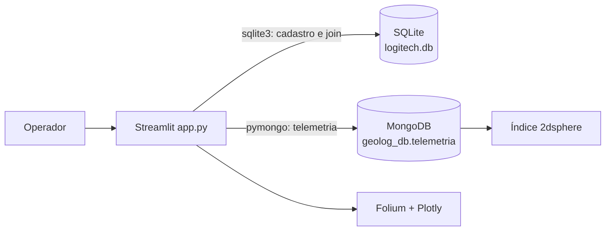

# Relatório técnico — GeoLog

**Disciplina:** Persistência de Dados  
**Projeto:** Plataforma GeoLog para a LogiTech Express  
**Integrantes:** Gabriel Eduardo Vilar Rocha

## 1. Arquitetura

A GeoLog adota Persistência Poliglota. O SQLite mantém os dados com maior exigência
transacional: `motoristas` e `veiculos`, ligados por chave estrangeira. O MongoDB
mantém a telemetria de alta frequência em documentos flexíveis, com localização
GeoJSON no formato `Point` e coordenadas `[longitude, latitude]`.



## 2. Implementação

Na inicialização, a aplicação cria as tabelas relacionais, insere a carga inicial e
executa `create_index([('location', '2dsphere')])`. A busca de raio usa `$near` com
`$maxDistance` em metros. A camada de apresentação desenha o ponto de referência,
o círculo do raio e marcadores dos veículos encontrados.

O join poliglota ocorre em memória: o cadastro é lido com SQL e a última leitura de
cada veículo é consolidada no MongoDB com pipeline `$sort` + `$group`; os DataFrames
são então associados por `veiculo_id`.

## 3. Indicadores e segurança operacional

O dashboard calcula frotas ativas, temperatura média das últimas leituras e alertas
de velocidade acima de 80 km/h. Também mostra a série histórica de temperatura por
placa e a distribuição dos status dos motoristas. A aplicação trata indisponibilidade
do MongoDB sem esconder o estado da conexão: os dados SQLite continuam acessíveis e
a interface orienta a configuração do serviço.

## 4. Simulador de telemetria

Como recurso adicional, a interface possui o botão **Simular Movimentação**. Ao ser
acionado, o sistema consulta a última posição de cada veículo, aplica uma pequena
variação aleatória nas coordenadas, temperatura e velocidade, e grava uma nova
leitura no MongoDB com o horário atual. Em seguida, o Streamlit executa uma nova
renderização, atualizando o mapa, os indicadores e o histórico sem reiniciar o
processo da aplicação.

## 5. Execução e testes

```bash
python -m pip install -r requirements.txt
python -m streamlit run app.py
```

Variáveis opcionais: `MONGO_URI`, `MONGO_DATABASE` e `MONGO_COLLECTION`.

Para validar a aplicação, foram considerados os seguintes testes:

1. inicialização automática do SQLite e carga das tabelas relacionais;
2. conexão com o MongoDB e criação do índice `location_2dsphere`;
3. busca de veículos usando `$near` e filtro por raio;
4. associação da última telemetria ao motorista e à placa;
5. atualização dos KPIs e gráficos após novas leituras;
6. inserção de novos pontos pelo botão **Simular Movimentação**.

## 6. Conclusão

A solução demonstra a separação de responsabilidades entre o banco relacional e o
banco orientado a documentos. O SQLite garante a integridade dos cadastros, enquanto
o MongoDB atende ao armazenamento flexível e às consultas geoespaciais da telemetria.
O Streamlit integra as duas fontes em uma interface única para acompanhamento da
operação da frota.
