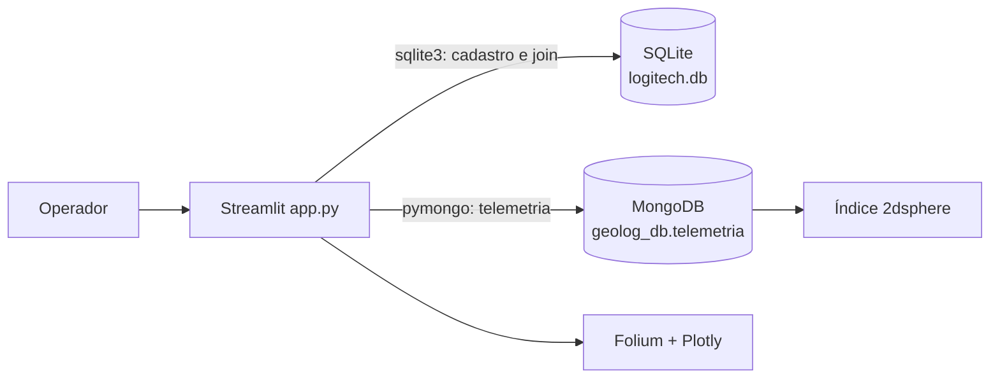

# Relatório técnico — GeoLog

## 1. Arquitetura

A GeoLog adota Persistência Poliglota. O SQLite mantém os dados com maior exigência
transacional: `motoristas` e `veiculos`, ligados por chave estrangeira. O MongoDB
mantém a telemetria de alta frequência em documentos flexíveis, com localização
GeoJSON no formato `Point` e coordenadas `[longitude, latitude]`.



## 2. Implementação

Na inicialização, a aplicação cria as tabelas relacionais, insere a carga inicial e
executa `create_index([('location', '2dsphere')])`. A busca de raio usa `$near` com
`$maxDistance` em metros. A camada de apresentação desenha o ponto de referência,
o círculo do raio e marcadores dos veículos encontrados.

O join poliglota ocorre em memória: o cadastro é lido com SQL e a última leitura de
cada veículo é consolidada no MongoDB com pipeline `$sort` + `$group`; os DataFrames
são então associados por `veiculo_id`.

## 3. Indicadores e segurança operacional

O dashboard calcula frotas ativas, temperatura média das últimas leituras e alertas
de velocidade acima de 80 km/h. Também mostra a série histórica de temperatura por
placa e a distribuição dos status dos motoristas. A aplicação trata indisponibilidade
do MongoDB sem esconder o estado da conexão: os dados SQLite continuam acessíveis e
a interface orienta a configuração do serviço.

## 4. Execução

```bash
python -m pip install -r requirements.txt
streamlit run app.py
```

Variáveis opcionais: `MONGO_URI`, `MONGO_DATABASE` e `MONGO_COLLECTION`.
